Bộ sơ đồ phân tích & thiết kế hệ thống Eldercare (bám sát app + server)
1) Nguyên tắc bám sát hệ thống hiện tại
Bộ sơ đồ này được thiết kế theo đúng cấu trúc hệ thống trong hai repository:
`eldercare_app`: Flutter app, điều hướng chính qua các màn hình `/devices`, `/register`, `/history`, `/alerts`, `/account`, `/admin/devices/register`.
`docker-environment`: FastAPI backend theo mô hình device-centric, phân quyền theo liên kết thiết bị `owner` / `viewer`, có nhóm API `auth`, `users`, `devices`, `alerts`, `esp`, chạy cùng `MongoDB`, `Redis`, `cloudflared`, `Node-RED` trong Docker Compose.
Diễn giải actor để dùng trong báo cáo
Để UML sát nghiệp vụ và vẫn dễ hiểu khi viết báo cáo, nên dùng các actor sau:
Khách / Người dùng chưa đăng nhập: chỉ có đăng ký, đăng nhập.
Người dùng đã xác thực: tài khoản đã có phiên đăng nhập.
Chủ thiết bị (Owner): người sở hữu quyền quản trị một thiết bị.
Người xem (Viewer): người được chia sẻ quyền xem dữ liệu thiết bị.
Quản trị viên (Admin): quản trị hệ thống, đăng ký/cấp mã ghép nối thiết bị.
Thiết bị ESP32/Wearable: actor ngoài hệ thống, gửi dữ liệu và nhận lệnh ECG.
> Lưu ý: nếu muốn viết theo ngôn ngữ đề tài, có thể đổi tên:
> - “Chủ thiết bị” → “Người thân/chăm sóc chính”
> - “Người xem” → “Người thân phụ / bác sĩ / điều dưỡng được chia sẻ quyền xem”
> Nhưng trong UML vẫn nên giữ logic quyền `owner/viewer` để sát code.
---
2) Danh sách sơ đồ nên đưa vào báo cáo
Nhóm Use Case
Sơ đồ Use Case tổng quan toàn hệ thống
Sơ đồ Use Case chi tiết phân hệ Tài khoản & Xác thực
Sơ đồ Use Case chi tiết phân hệ Chủ thiết bị
Sơ đồ Use Case chi tiết phân hệ Người xem
Sơ đồ Use Case chi tiết phân hệ Quản trị viên
Sơ đồ Use Case chi tiết phân hệ Thiết bị ESP32
Nhóm Sequence
Sơ đồ Sequence tổng quan luồng App ↔ API ↔ DB
Sơ đồ Sequence đăng ký / đăng nhập / khôi phục phiên
Sơ đồ Sequence liên kết thiết bị bằng mã ghép nối
Sơ đồ Sequence tải dashboard thiết bị (latest/history/alerts)
Sơ đồ Sequence quản lý người xem
Sơ đồ Sequence yêu cầu ECG theo lệnh từ app
Sơ đồ Sequence xác nhận xử lý cảnh báo
Sơ đồ Sequence admin đăng ký thiết bị / cấp lại pairing code
Sơ đồ Sequence ESP gửi dữ liệu sức khỏe và backend sinh cảnh báo
Nhóm Activity
Sơ đồ Activity tổng quan nghiệp vụ
Sơ đồ Activity đăng ký / đăng nhập
Sơ đồ Activity liên kết thiết bị
Sơ đồ Activity quản lý người xem
Sơ đồ Activity yêu cầu ECG
Sơ đồ Activity xử lý cảnh báo
Nhóm kiến trúc hệ thống
Sơ đồ Component tổng quan app-server
Sơ đồ Deployment tổng quan Docker/Production
---
3) Các sơ đồ PlantUML
---
Hình UC-01. Use Case tổng quan toàn hệ thống
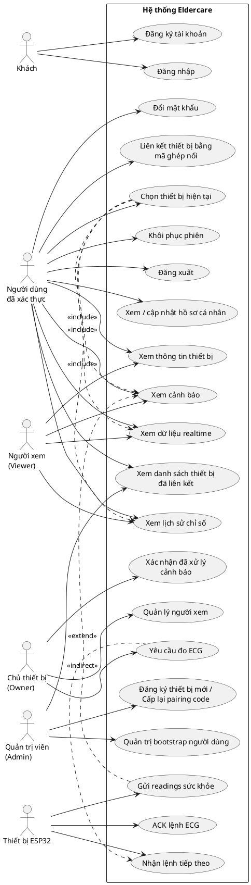
```plantuml
@startuml
left to right direction
skinparam packageStyle rectangle

actor "Khách" as Guest
actor "Người dùng\nđã xác thực" as User
actor "Chủ thiết bị\n(Owner)" as Owner
actor "Người xem\n(Viewer)" as Viewer
actor "Quản trị viên\n(Admin)" as Admin
actor "Thiết bị ESP32" as ESP

rectangle "Hệ thống Eldercare" {
  usecase "Đăng ký tài khoản" as UC_Register
  usecase "Đăng nhập" as UC_Login
  usecase "Khôi phục phiên" as UC_Restore
  usecase "Đăng xuất" as UC_Logout
  usecase "Xem / cập nhật hồ sơ cá nhân" as UC_Profile
  usecase "Đổi mật khẩu" as UC_ChangePassword

  usecase "Xem danh sách thiết bị\nđã liên kết" as UC_ListDevices
  usecase "Chọn thiết bị hiện tại" as UC_SelectDevice
  usecase "Liên kết thiết bị bằng\nmã ghép nối" as UC_ClaimDevice

  usecase "Xem dữ liệu realtime" as UC_Realtime
  usecase "Xem lịch sử chỉ số" as UC_History
  usecase "Xem cảnh báo" as UC_Alerts
  usecase "Xác nhận đã xử lý\ncảnh báo" as UC_AckAlert

  usecase "Quản lý người xem" as UC_ManageViewers
  usecase "Yêu cầu đo ECG" as UC_RequestECG
  usecase "Xem thông tin thiết bị" as UC_DeviceInfo

  usecase "Đăng ký thiết bị mới /\nCấp lại pairing code" as UC_RegisterDevice
  usecase "Quản trị bootstrap người dùng" as UC_BootstrapUser

  usecase "Gửi readings sức khỏe" as UC_SendReadings
  usecase "Nhận lệnh tiếp theo" as UC_GetNextCommand
  usecase "ACK lệnh ECG" as UC_AckCommand
}

Guest --> UC_Register
Guest --> UC_Login

User --> UC_Restore
User --> UC_Logout
User --> UC_Profile
User --> UC_ChangePassword
User --> UC_ListDevices
User --> UC_SelectDevice
User --> UC_ClaimDevice
User --> UC_Realtime
User --> UC_History
User --> UC_Alerts
User --> UC_DeviceInfo

Owner --> UC_AckAlert
Owner --> UC_ManageViewers
Owner --> UC_RequestECG

Viewer --> UC_Realtime
Viewer --> UC_History
Viewer --> UC_Alerts
Viewer --> UC_DeviceInfo

Admin --> UC_RegisterDevice
Admin --> UC_BootstrapUser
Admin --> UC_ListDevices

ESP --> UC_SendReadings
ESP --> UC_GetNextCommand
ESP --> UC_AckCommand

UC_SelectDevice .> UC_Realtime : <<include>>
UC_SelectDevice .> UC_History : <<include>>
UC_SelectDevice .> UC_Alerts : <<include>>
UC_RequestECG .> UC_GetNextCommand : <<indirect>>
UC_SendReadings .> UC_Alerts : <<extend>>
@enduml
```
---
Hình UC-02. Use Case chi tiết phân hệ Tài khoản & Xác thực
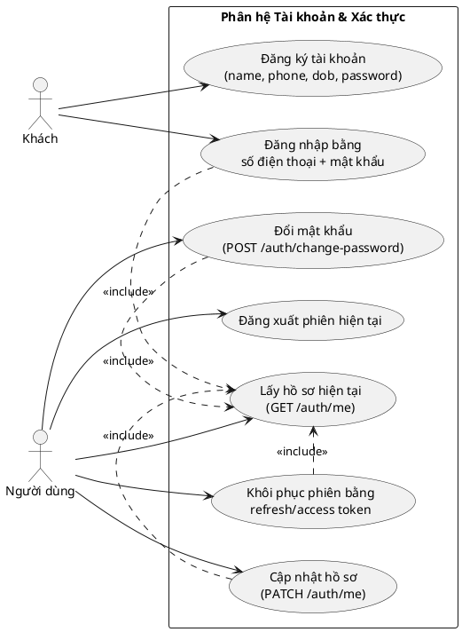
```plantuml
@startuml
left to right direction
skinparam packageStyle rectangle

actor "Khách" as Guest
actor "Người dùng" as User

rectangle "Phân hệ Tài khoản & Xác thực" {
  usecase "Đăng ký tài khoản\n(name, phone, dob, password)" as UC_Register
  usecase "Đăng nhập bằng\nsố điện thoại + mật khẩu" as UC_Login
  usecase "Khôi phục phiên bằng\nrefresh/access token" as UC_Restore
  usecase "Đăng xuất phiên hiện tại" as UC_Logout
  usecase "Lấy hồ sơ hiện tại\n(GET /auth/me)" as UC_GetMe
  usecase "Cập nhật hồ sơ\n(PATCH /auth/me)" as UC_UpdateMe
  usecase "Đổi mật khẩu\n(POST /auth/change-password)" as UC_ChangePassword
}

Guest --> UC_Register
Guest --> UC_Login

User --> UC_Restore
User --> UC_Logout
User --> UC_GetMe
User --> UC_UpdateMe
User --> UC_ChangePassword

UC_Login .> UC_GetMe : <<include>>
UC_Restore .> UC_GetMe : <<include>>
UC_UpdateMe .> UC_GetMe : <<include>>
UC_ChangePassword .> UC_GetMe : <<include>>
@enduml
```
---
Hình UC-03. Use Case chi tiết phân hệ Chủ thiết bị
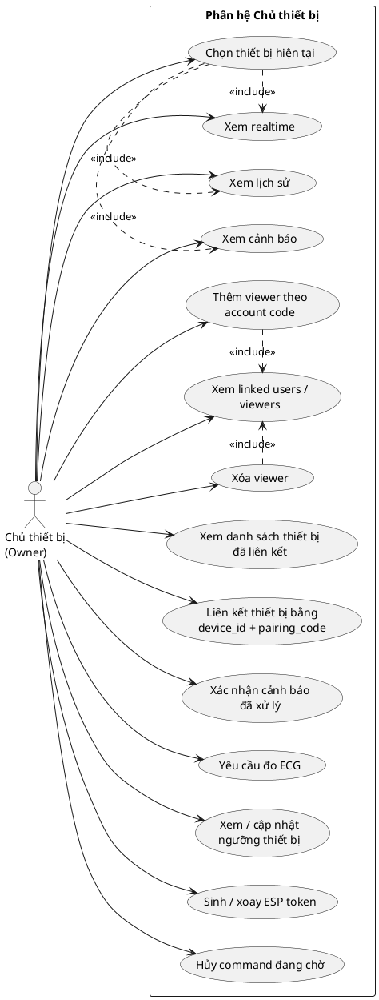
```plantuml
@startuml
left to right direction
skinparam packageStyle rectangle

actor "Chủ thiết bị\n(Owner)" as Owner

rectangle "Phân hệ Chủ thiết bị" {
  usecase "Xem danh sách thiết bị\nđã liên kết" as UC_List
  usecase "Liên kết thiết bị bằng\ndevice_id + pairing_code" as UC_Claim
  usecase "Chọn thiết bị hiện tại" as UC_Select
  usecase "Xem realtime" as UC_Realtime
  usecase "Xem lịch sử" as UC_History
  usecase "Xem cảnh báo" as UC_Alerts
  usecase "Xác nhận cảnh báo\nđã xử lý" as UC_Ack
  usecase "Xem linked users /\nviewers" as UC_ViewLinked
  usecase "Thêm viewer theo\naccount code" as UC_AddViewer
  usecase "Xóa viewer" as UC_RemoveViewer
  usecase "Yêu cầu đo ECG" as UC_ECG
  usecase "Xem / cập nhật\nngưỡng thiết bị" as UC_Thresholds
  usecase "Sinh / xoay ESP token" as UC_RotateEspToken
  usecase "Hủy command đang chờ" as UC_CancelCmd
}

Owner --> UC_List
Owner --> UC_Claim
Owner --> UC_Select
Owner --> UC_Realtime
Owner --> UC_History
Owner --> UC_Alerts
Owner --> UC_Ack
Owner --> UC_ViewLinked
Owner --> UC_AddViewer
Owner --> UC_RemoveViewer
Owner --> UC_ECG
Owner --> UC_Thresholds
Owner --> UC_RotateEspToken
Owner --> UC_CancelCmd

UC_Select .> UC_Realtime : <<include>>
UC_Select .> UC_History : <<include>>
UC_Select .> UC_Alerts : <<include>>
UC_AddViewer .> UC_ViewLinked : <<include>>
UC_RemoveViewer .> UC_ViewLinked : <<include>>
@enduml
```
---
Hình UC-04. Use Case chi tiết phân hệ Người xem
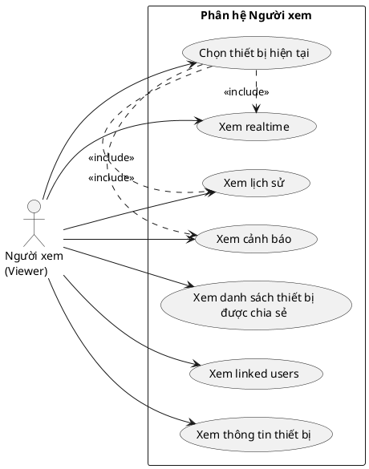
```plantuml
@startuml
left to right direction
skinparam packageStyle rectangle

actor "Người xem\n(Viewer)" as Viewer

rectangle "Phân hệ Người xem" {
  usecase "Xem danh sách thiết bị\nđược chia sẻ" as UC_List
  usecase "Chọn thiết bị hiện tại" as UC_Select
  usecase "Xem realtime" as UC_Realtime
  usecase "Xem lịch sử" as UC_History
  usecase "Xem cảnh báo" as UC_Alerts
  usecase "Xem linked users" as UC_LinkedUsers
  usecase "Xem thông tin thiết bị" as UC_DeviceInfo
}

Viewer --> UC_List
Viewer --> UC_Select
Viewer --> UC_Realtime
Viewer --> UC_History
Viewer --> UC_Alerts
Viewer --> UC_LinkedUsers
Viewer --> UC_DeviceInfo

UC_Select .> UC_Realtime : <<include>>
UC_Select .> UC_History : <<include>>
UC_Select .> UC_Alerts : <<include>>
@enduml
```
---
Hình UC-05. Use Case chi tiết phân hệ Quản trị viên
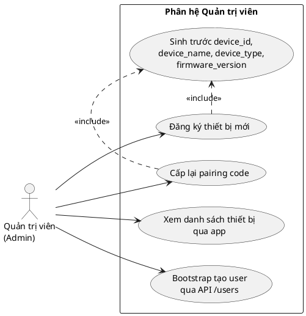
```plantuml
@startuml
left to right direction
skinparam packageStyle rectangle

actor "Quản trị viên\n(Admin)" as Admin

rectangle "Phân hệ Quản trị viên" {
  usecase "Đăng ký thiết bị mới" as UC_RegisterDevice
  usecase "Cấp lại pairing code" as UC_ReissuePairing
  usecase "Sinh trước device_id,\ndevice_name, device_type,\nfirmware_version" as UC_DeviceMeta
  usecase "Xem danh sách thiết bị\nqua app" as UC_ListDevices
  usecase "Bootstrap tạo user\nqua API /users" as UC_BootstrapUser
}

Admin --> UC_RegisterDevice
Admin --> UC_ReissuePairing
Admin --> UC_ListDevices
Admin --> UC_BootstrapUser

UC_RegisterDevice .> UC_DeviceMeta : <<include>>
UC_ReissuePairing .> UC_DeviceMeta : <<include>>
@enduml
```
---
Hình UC-06. Use Case chi tiết phân hệ Thiết bị ESP32
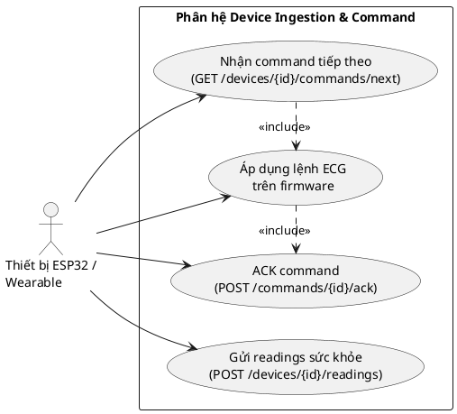
```plantuml
@startuml
left to right direction
skinparam packageStyle rectangle

actor "Thiết bị ESP32 /\nWearable" as ESP

rectangle "Phân hệ Device Ingestion & Command" {
  usecase "Gửi readings sức khỏe\n(POST /devices/{id}/readings)" as UC_Ingest
  usecase "Nhận command tiếp theo\n(GET /devices/{id}/commands/next)" as UC_Next
  usecase "ACK command\n(POST /commands/{id}/ack)" as UC_Ack
  usecase "Áp dụng lệnh ECG\ntrên firmware" as UC_Apply
}

ESP --> UC_Ingest
ESP --> UC_Next
ESP --> UC_Ack
ESP --> UC_Apply

UC_Next .> UC_Apply : <<include>>
UC_Apply .> UC_Ack : <<include>>
@enduml
```
---
Hình SQ-01. Sequence tổng quan App ↔ API ↔ DB
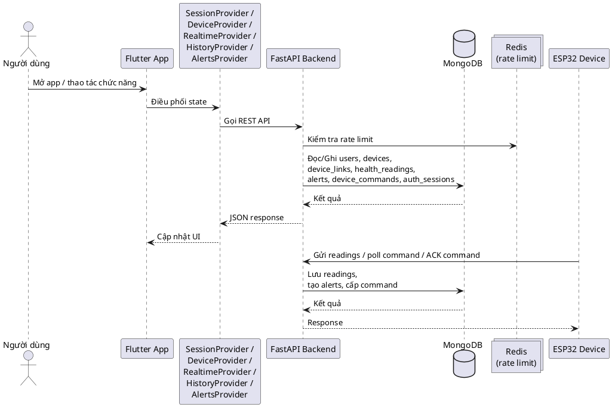
```plantuml
@startuml
actor "Người dùng" as User
participant "Flutter App" as App
participant "SessionProvider /\nDeviceProvider /\nRealtimeProvider /\nHistoryProvider /\nAlertsProvider" as Providers
participant "FastAPI Backend" as API
database "MongoDB" as DB
collections "Redis\n(rate limit)" as Redis
participant "ESP32 Device" as ESP

User -> App: Mở app / thao tác chức năng
App -> Providers: Điều phối state
Providers -> API: Gọi REST API
API -> Redis: Kiểm tra rate limit
API -> DB: Đọc/Ghi users, devices,\ndevice_links, health_readings,\nalerts, device_commands, auth_sessions
DB --> API: Kết quả
API --> Providers: JSON response
Providers --> App: Cập nhật UI

ESP -> API: Gửi readings / poll command / ACK command
API -> DB: Lưu readings,\ntạo alerts, cấp command
DB --> API: Kết quả
API --> ESP: Response
@enduml
```
---
Hình SQ-02. Sequence đăng ký / đăng nhập / khôi phục phiên
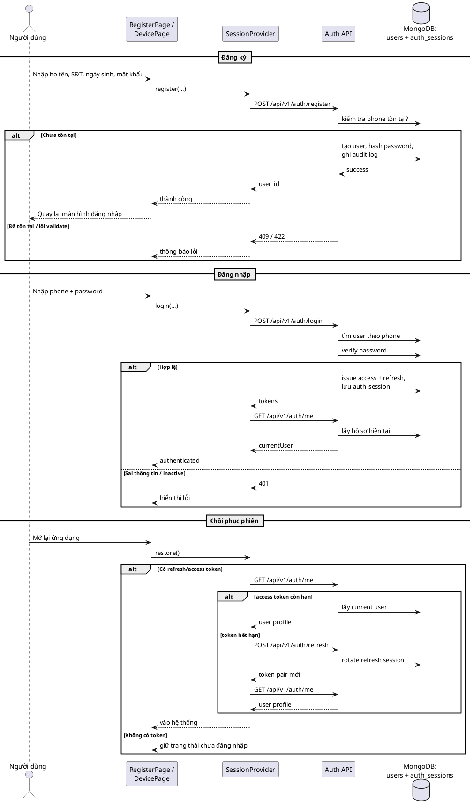
```plantuml
@startuml
actor "Người dùng" as User
participant "RegisterPage /\nDevicePage" as App
participant "SessionProvider" as Session
participant "Auth API" as Auth
database "MongoDB:\nusers + auth_sessions" as DB

== Đăng ký ==
User -> App: Nhập họ tên, SĐT, ngày sinh, mật khẩu
App -> Session: register(...)
Session -> Auth: POST /api/v1/auth/register
Auth -> DB: kiểm tra phone tồn tại?
alt Chưa tồn tại
  Auth -> DB: tạo user, hash password,\nghi audit log
  DB --> Auth: success
  Auth --> Session: user_id
  Session --> App: thành công
  App --> User: Quay lại màn hình đăng nhập
else Đã tồn tại / lỗi validate
  Auth --> Session: 409 / 422
  Session --> App: thông báo lỗi
end

== Đăng nhập ==
User -> App: Nhập phone + password
App -> Session: login(...)
Session -> Auth: POST /api/v1/auth/login
Auth -> DB: tìm user theo phone
Auth -> DB: verify password
alt Hợp lệ
  Auth -> DB: issue access + refresh,\nlưu auth_session
  Auth --> Session: tokens
  Session -> Auth: GET /api/v1/auth/me
  Auth -> DB: lấy hồ sơ hiện tại
  Auth --> Session: currentUser
  Session --> App: authenticated
else Sai thông tin / inactive
  Auth --> Session: 401
  Session --> App: hiển thị lỗi
end

== Khôi phục phiên ==
User -> App: Mở lại ứng dụng
App -> Session: restore()
alt Có refresh/access token
  Session -> Auth: GET /api/v1/auth/me
  alt access token còn hạn
    Auth -> DB: lấy current user
    Auth --> Session: user profile
  else token hết hạn
    Session -> Auth: POST /api/v1/auth/refresh
    Auth -> DB: rotate refresh session
    Auth --> Session: token pair mới
    Session -> Auth: GET /api/v1/auth/me
    Auth --> Session: user profile
  end
  Session --> App: vào hệ thống
else Không có token
  Session --> App: giữ trạng thái chưa đăng nhập
end
@enduml
```
---
Hình SQ-03. Sequence liên kết thiết bị bằng pairing code
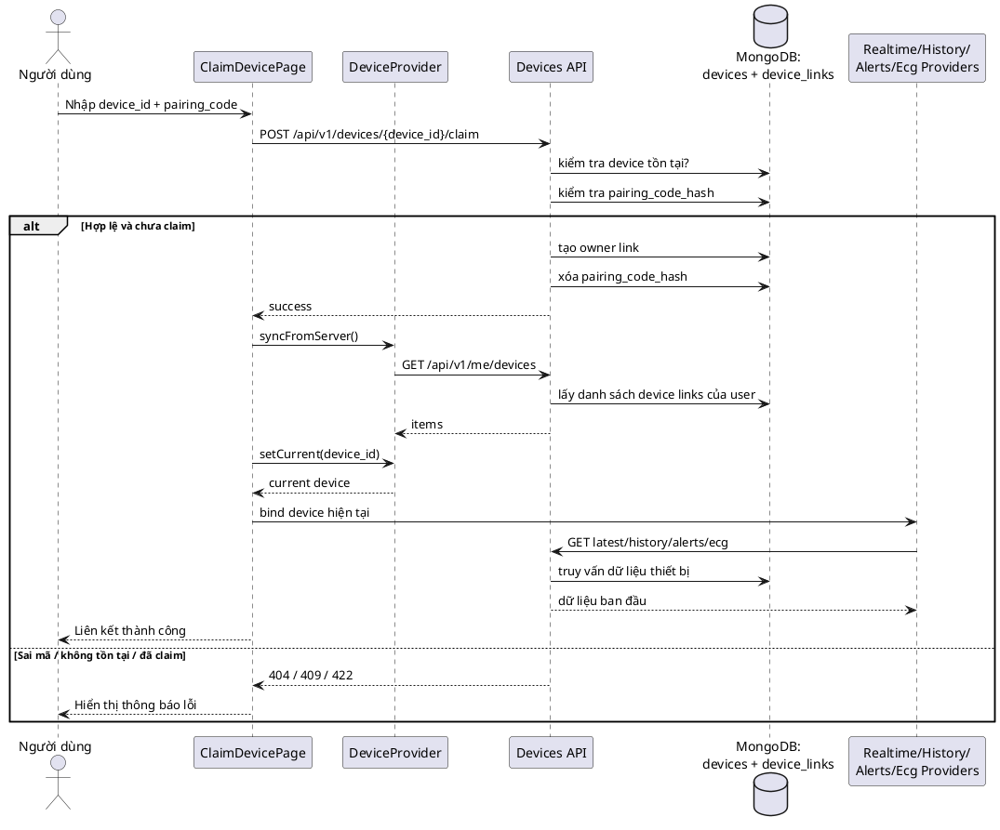
```plantuml
@startuml
actor "Người dùng" as User
participant "ClaimDevicePage" as App
participant "DeviceProvider" as DeviceState
participant "Devices API" as API
database "MongoDB:\ndevices + device_links" as DB
participant "Realtime/History/\nAlerts/Ecg Providers" as OtherState

User -> App: Nhập device_id + pairing_code
App -> API: POST /api/v1/devices/{device_id}/claim
API -> DB: kiểm tra device tồn tại?
API -> DB: kiểm tra pairing_code_hash
alt Hợp lệ và chưa claim
  API -> DB: tạo owner link
  API -> DB: xóa pairing_code_hash
  API --> App: success
  App -> DeviceState: syncFromServer()
  DeviceState -> API: GET /api/v1/me/devices
  API -> DB: lấy danh sách device links của user
  API --> DeviceState: items
  App -> DeviceState: setCurrent(device_id)
  DeviceState --> App: current device
  App -> OtherState: bind device hiện tại
  OtherState -> API: GET latest/history/alerts/ecg
  API -> DB: truy vấn dữ liệu thiết bị
  API --> OtherState: dữ liệu ban đầu
  App --> User: Liên kết thành công
else Sai mã / không tồn tại / đã claim
  API --> App: 404 / 409 / 422
  App --> User: Hiển thị thông báo lỗi
end
@enduml
```
---
Hình SQ-04. Sequence tải dashboard thiết bị (latest/history/alerts)
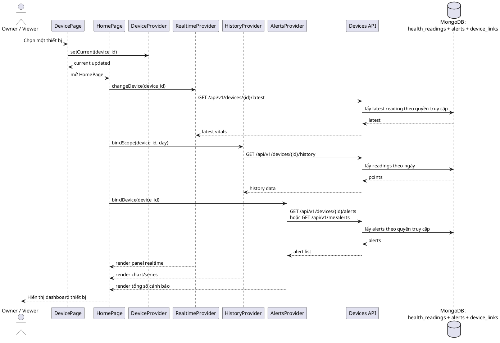
```plantuml
@startuml
actor "Owner / Viewer" as User
participant "DevicePage" as DevicePage
participant "HomePage" as Home
participant "DeviceProvider" as DeviceState
participant "RealtimeProvider" as Realtime
participant "HistoryProvider" as History
participant "AlertsProvider" as Alerts
participant "Devices API" as API
database "MongoDB:\nhealth_readings + alerts + device_links" as DB

User -> DevicePage: Chọn một thiết bị
DevicePage -> DeviceState: setCurrent(device_id)
DeviceState --> DevicePage: current updated
DevicePage -> Home: mở HomePage

Home -> Realtime: changeDevice(device_id)
Realtime -> API: GET /api/v1/devices/{id}/latest
API -> DB: lấy latest reading theo quyền truy cập
DB --> API: latest
API --> Realtime: latest vitals

Home -> History: bindScope(device_id, day)
History -> API: GET /api/v1/devices/{id}/history
API -> DB: lấy readings theo ngày
DB --> API: points
API --> History: history data

Home -> Alerts: bindDevice(device_id)
Alerts -> API: GET /api/v1/devices/{id}/alerts\nhoặc GET /api/v1/me/alerts
API -> DB: lấy alerts theo quyền truy cập
DB --> API: alerts
API --> Alerts: alert list

Realtime --> Home: render panel realtime
History --> Home: render chart/series
Alerts --> Home: render tổng số cảnh báo
Home --> User: Hiển thị dashboard thiết bị
@enduml
```
---
Hình SQ-05. Sequence quản lý người xem
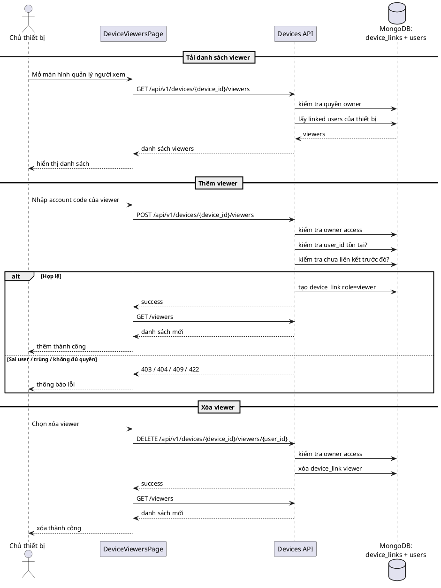
```plantuml
@startuml
actor "Chủ thiết bị" as Owner
participant "DeviceViewersPage" as App
participant "Devices API" as API
database "MongoDB:\ndevice_links + users" as DB

== Tải danh sách viewer ==
Owner -> App: Mở màn hình quản lý người xem
App -> API: GET /api/v1/devices/{device_id}/viewers
API -> DB: kiểm tra quyền owner
API -> DB: lấy linked users của thiết bị
DB --> API: viewers
API --> App: danh sách viewers
App --> Owner: hiển thị danh sách

== Thêm viewer ==
Owner -> App: Nhập account code của viewer
App -> API: POST /api/v1/devices/{device_id}/viewers
API -> DB: kiểm tra owner access
API -> DB: kiểm tra user_id tồn tại?
API -> DB: kiểm tra chưa liên kết trước đó?
alt Hợp lệ
  API -> DB: tạo device_link role=viewer
  API --> App: success
  App -> API: GET /viewers
  API --> App: danh sách mới
  App --> Owner: thêm thành công
else Sai user / trùng / không đủ quyền
  API --> App: 403 / 404 / 409 / 422
  App --> Owner: thông báo lỗi
end

== Xóa viewer ==
Owner -> App: Chọn xóa viewer
App -> API: DELETE /api/v1/devices/{device_id}/viewers/{user_id}
API -> DB: kiểm tra owner access
API -> DB: xóa device_link viewer
API --> App: success
App -> API: GET /viewers
API --> App: danh sách mới
App --> Owner: xóa thành công
@enduml
```
---
Hình SQ-06. Sequence yêu cầu ECG theo lệnh từ app
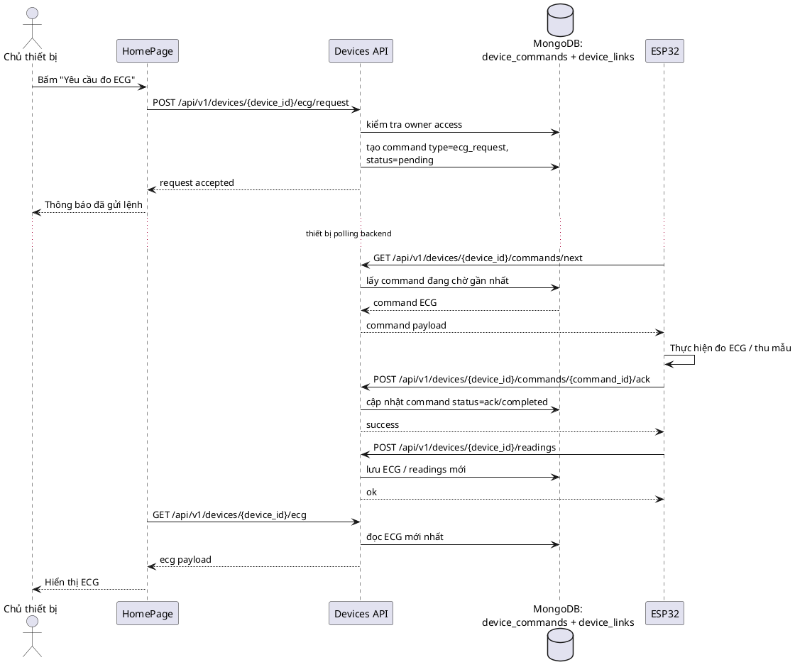
```plantuml
@startuml
actor "Chủ thiết bị" as Owner
participant "HomePage" as App
participant "Devices API" as API
database "MongoDB:\ndevice_commands + device_links" as DB
participant "ESP32" as ESP

Owner -> App: Bấm "Yêu cầu đo ECG"
App -> API: POST /api/v1/devices/{device_id}/ecg/request
API -> DB: kiểm tra owner access
API -> DB: tạo command type=ecg_request,\nstatus=pending
API --> App: request accepted
App --> Owner: Thông báo đã gửi lệnh

... thiết bị polling backend ...
ESP -> API: GET /api/v1/devices/{device_id}/commands/next
API -> DB: lấy command đang chờ gần nhất
DB --> API: command ECG
API --> ESP: command payload

ESP -> ESP: Thực hiện đo ECG / thu mẫu
ESP -> API: POST /api/v1/devices/{device_id}/commands/{command_id}/ack
API -> DB: cập nhật command status=ack/completed
API --> ESP: success

ESP -> API: POST /api/v1/devices/{device_id}/readings
API -> DB: lưu ECG / readings mới
API --> ESP: ok

App -> API: GET /api/v1/devices/{device_id}/ecg
API -> DB: đọc ECG mới nhất
API --> App: ecg payload
App --> Owner: Hiển thị ECG
@enduml
```
---
Hình SQ-07. Sequence xác nhận xử lý cảnh báo
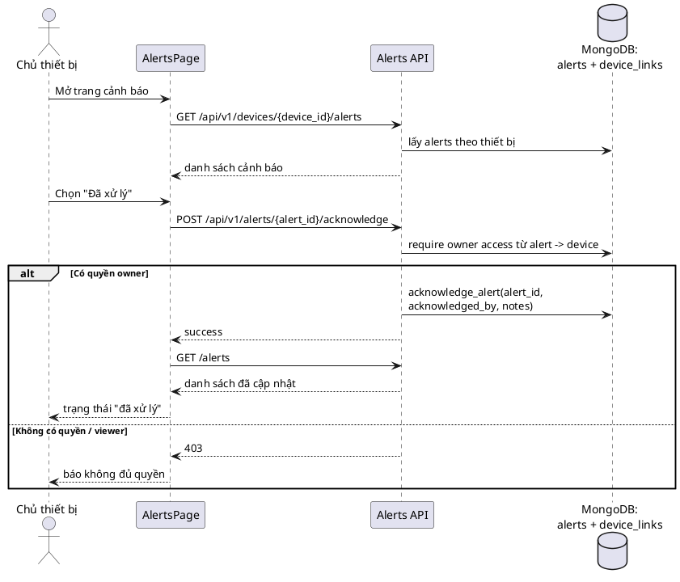
```plantuml
@startuml
actor "Chủ thiết bị" as Owner
participant "AlertsPage" as App
participant "Alerts API" as API
database "MongoDB:\nalerts + device_links" as DB

Owner -> App: Mở trang cảnh báo
App -> API: GET /api/v1/devices/{device_id}/alerts
API -> DB: lấy alerts theo thiết bị
API --> App: danh sách cảnh báo

Owner -> App: Chọn "Đã xử lý"
App -> API: POST /api/v1/alerts/{alert_id}/acknowledge
API -> DB: require owner access từ alert -> device
alt Có quyền owner
  API -> DB: acknowledge_alert(alert_id,\nacknowledged_by, notes)
  API --> App: success
  App -> API: GET /alerts
  API --> App: danh sách đã cập nhật
  App --> Owner: trạng thái "đã xử lý"
else Không có quyền / viewer
  API --> App: 403
  App --> Owner: báo không đủ quyền
end
@enduml
```
---
Hình SQ-08. Sequence admin đăng ký thiết bị / cấp lại pairing code
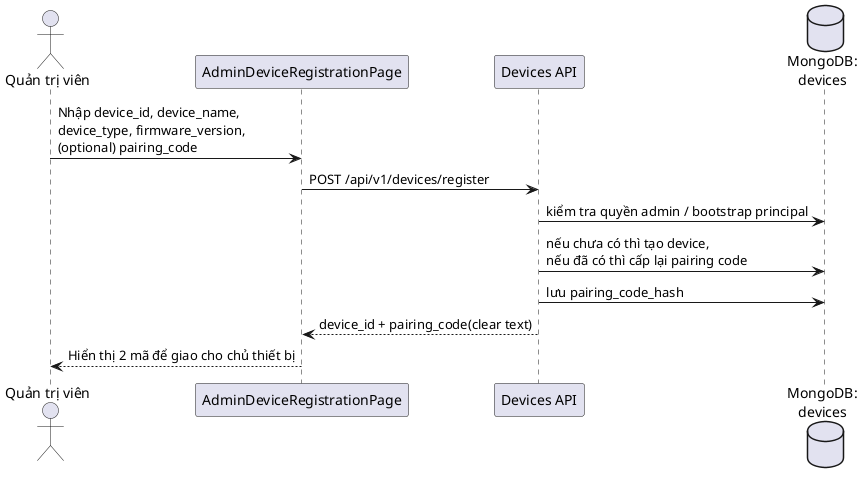
```plantuml
@startuml
actor "Quản trị viên" as Admin
participant "AdminDeviceRegistrationPage" as App
participant "Devices API" as API
database "MongoDB:\ndevices" as DB

Admin -> App: Nhập device_id, device_name,\ndevice_type, firmware_version,\n(optional) pairing_code
App -> API: POST /api/v1/devices/register
API -> DB: kiểm tra quyền admin / bootstrap principal
API -> DB: nếu chưa có thì tạo device,\nnếu đã có thì cấp lại pairing code
API -> DB: lưu pairing_code_hash
API --> App: device_id + pairing_code(clear text)
App --> Admin: Hiển thị 2 mã để giao cho chủ thiết bị
@enduml
```
---
Hình SQ-09. Sequence ESP gửi readings và backend sinh cảnh báo
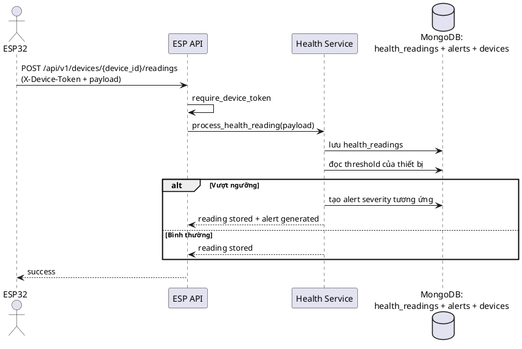
```plantuml
@startuml
actor "ESP32" as ESP
participant "ESP API" as API
participant "Health Service" as Service
database "MongoDB:\nhealth_readings + alerts + devices" as DB

ESP -> API: POST /api/v1/devices/{device_id}/readings\n(X-Device-Token + payload)
API -> API: require_device_token
API -> Service: process_health_reading(payload)
Service -> DB: lưu health_readings
Service -> DB: đọc threshold của thiết bị
alt Vượt ngưỡng
  Service -> DB: tạo alert severity tương ứng
  Service --> API: reading stored + alert generated
else Bình thường
  Service --> API: reading stored
end
API --> ESP: success
@enduml
```
---
Hình AC-01. Activity tổng quan nghiệp vụ
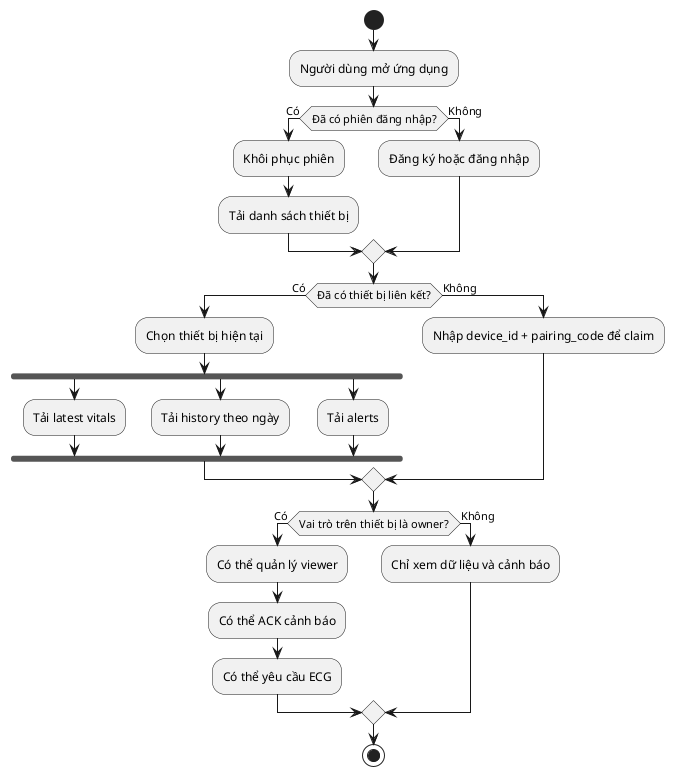
```plantuml
@startuml
start
:Người dùng mở ứng dụng;
if (Đã có phiên đăng nhập?) then (Có)
  :Khôi phục phiên;
  :Tải danh sách thiết bị;
else (Không)
  :Đăng ký hoặc đăng nhập;
endif

if (Đã có thiết bị liên kết?) then (Có)
  :Chọn thiết bị hiện tại;
  fork
    :Tải latest vitals;
  fork again
    :Tải history theo ngày;
  fork again
    :Tải alerts;
  end fork
else (Không)
  :Nhập device_id + pairing_code để claim;
endif

if (Vai trò trên thiết bị là owner?) then (Có)
  :Có thể quản lý viewer;
  :Có thể ACK cảnh báo;
  :Có thể yêu cầu ECG;
else (Không)
  :Chỉ xem dữ liệu và cảnh báo;
endif
stop
@enduml
```
---
Hình AC-02. Activity đăng ký / đăng nhập
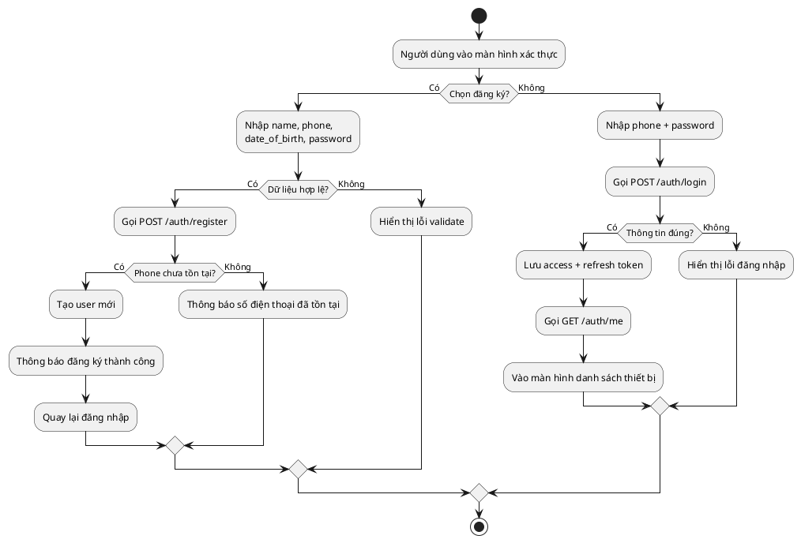
```plantuml
@startuml
start
:Người dùng vào màn hình xác thực;
if (Chọn đăng ký?) then (Có)
  :Nhập name, phone,\ndate_of_birth, password;
  if (Dữ liệu hợp lệ?) then (Có)
    :Gọi POST /auth/register;
    if (Phone chưa tồn tại?) then (Có)
      :Tạo user mới;
      :Thông báo đăng ký thành công;
      :Quay lại đăng nhập;
    else (Không)
      :Thông báo số điện thoại đã tồn tại;
    endif
  else (Không)
    :Hiển thị lỗi validate;
  endif
else (Không)
  :Nhập phone + password;
  :Gọi POST /auth/login;
  if (Thông tin đúng?) then (Có)
    :Lưu access + refresh token;
    :Gọi GET /auth/me;
    :Vào màn hình danh sách thiết bị;
  else (Không)
    :Hiển thị lỗi đăng nhập;
  endif
endif
stop
@enduml
```
---
Hình AC-03. Activity liên kết thiết bị
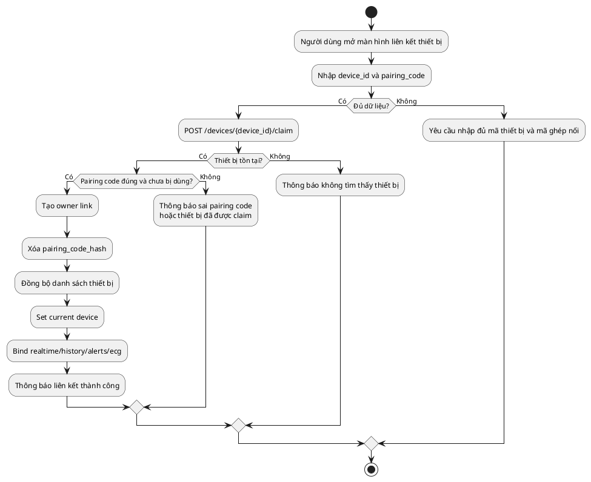
```plantuml
@startuml
start
:Người dùng mở màn hình liên kết thiết bị;
:Nhập device_id và pairing_code;
if (Đủ dữ liệu?) then (Có)
  :POST /devices/{device_id}/claim;
  if (Thiết bị tồn tại?) then (Có)
    if (Pairing code đúng và chưa bị dùng?) then (Có)
      :Tạo owner link;
      :Xóa pairing_code_hash;
      :Đồng bộ danh sách thiết bị;
      :Set current device;
      :Bind realtime/history/alerts/ecg;
      :Thông báo liên kết thành công;
    else (Không)
      :Thông báo sai pairing code\nhoặc thiết bị đã được claim;
    endif
  else (Không)
    :Thông báo không tìm thấy thiết bị;
  endif
else (Không)
  :Yêu cầu nhập đủ mã thiết bị và mã ghép nối;
endif
stop
@enduml
```
---
Hình AC-04. Activity quản lý người xem
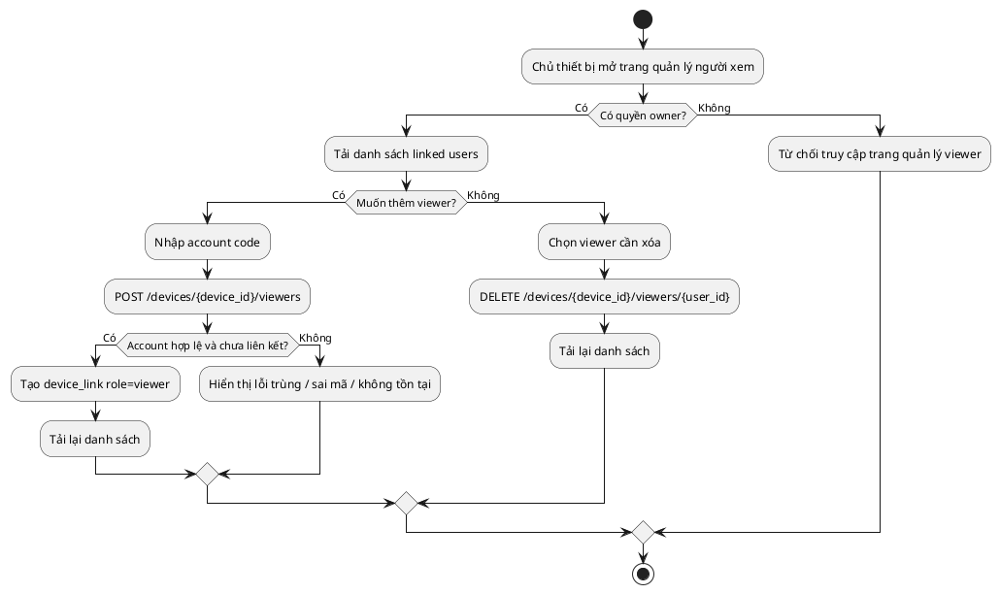
```plantuml
@startuml
start
:Chủ thiết bị mở trang quản lý người xem;
if (Có quyền owner?) then (Có)
  :Tải danh sách linked users;
  if (Muốn thêm viewer?) then (Có)
    :Nhập account code;
    :POST /devices/{device_id}/viewers;
    if (Account hợp lệ và chưa liên kết?) then (Có)
      :Tạo device_link role=viewer;
      :Tải lại danh sách;
    else (Không)
      :Hiển thị lỗi trùng / sai mã / không tồn tại;
    endif
  else (Không)
    :Chọn viewer cần xóa;
    :DELETE /devices/{device_id}/viewers/{user_id};
    :Tải lại danh sách;
  endif
else (Không)
  :Từ chối truy cập trang quản lý viewer;
endif
stop
@enduml
```
---
Hình AC-05. Activity yêu cầu ECG
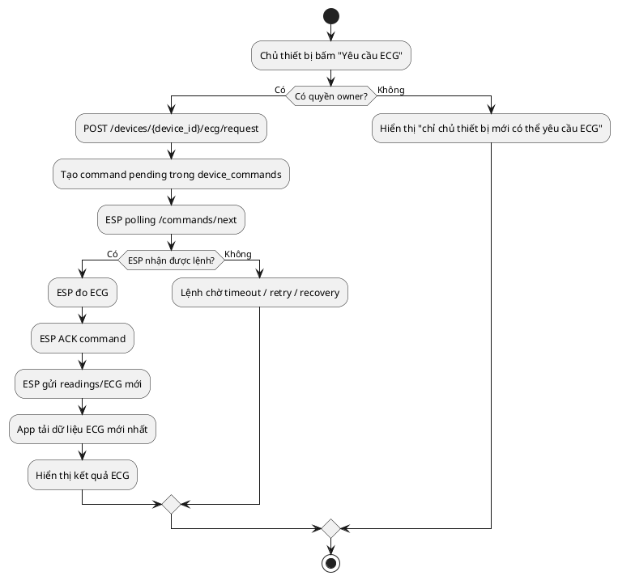
```plantuml
@startuml
start
:Chủ thiết bị bấm "Yêu cầu ECG";
if (Có quyền owner?) then (Có)
  :POST /devices/{device_id}/ecg/request;
  :Tạo command pending trong device_commands;
  :ESP polling /commands/next;
  if (ESP nhận được lệnh?) then (Có)
    :ESP đo ECG;
    :ESP ACK command;
    :ESP gửi readings/ECG mới;
    :App tải dữ liệu ECG mới nhất;
    :Hiển thị kết quả ECG;
  else (Không)
    :Lệnh chờ timeout / retry / recovery;
  endif
else (Không)
  :Hiển thị "chỉ chủ thiết bị mới có thể yêu cầu ECG";
endif
stop
@enduml
```
---
Hình AC-06. Activity xử lý cảnh báo
```plantuml
@startuml
start
:ESP gửi readings;
:Backend validate payload;
:Backend lưu health_readings;
if (Vượt ngưỡng?) then (Có)
  :Tạo alert mới;
else (Không)
  :Không tạo alert;
endif

:Người dùng mở trang cảnh báo;
if (Vai trò owner?) then (Owner)
  :Có nút xác nhận xử lý;
  if (Người dùng bấm ACK?) then (Có)
    :POST /alerts/{alert_id}/acknowledge;
    :Cập nhật acknowledged=true;
  else (Không)
    :Giữ nguyên trạng thái;
  endif
else (Viewer)
  :Chỉ xem cảnh báo;
endif
stop
@enduml
```
---
Hình CM-01. Component diagram tổng quan App-Server
```plantuml
@startuml
skinparam componentStyle rectangle

package "Flutter Client" {
  [RegisterPage]
  [DevicePage]
  [HomePage]
  [AlertsPage]
  [AccountPage]
  [AdminDeviceRegistrationPage]

  [SessionProvider]
  [DeviceProvider]
  [RealtimeProvider]
  [HistoryProvider]
  [AlertsProvider]
  [EcgProvider]

  [AuthApiService]
  [DeviceApiService]
  [AlertApiService]
}

package "FastAPI Backend" {
  [Auth Router]
  [Users Router]
  [Devices Router]
  [Alerts Router]
  [ESP Router]
  [Rate Limit Middleware]
  [Command Recovery Loop]
  [Health Service]
  [Auth Utils]
  [Access Utils]
}

database "MongoDB" {
  [users]
  [auth_sessions]
  [devices]
  [device_links]
  [health_readings]
  [alerts]
  [device_commands]
  [audit_logs]
}

queue "Redis" as Redis
component "ESP32 / Wearable" as ESP

[RegisterPage] --> [SessionProvider]
[DevicePage] --> [SessionProvider]
[DevicePage] --> [DeviceProvider]
[HomePage] --> [RealtimeProvider]
[HomePage] --> [HistoryProvider]
[HomePage] --> [AlertsProvider]
[HomePage] --> [EcgProvider]
[AlertsPage] --> [AlertsProvider]
[AccountPage] --> [SessionProvider]
[AdminDeviceRegistrationPage] --> [DeviceProvider]

[SessionProvider] --> [AuthApiService]
[DeviceProvider] --> [DeviceApiService]
[RealtimeProvider] --> [DeviceApiService]
[HistoryProvider] --> [DeviceApiService]
[AlertsProvider] --> [AlertApiService]
[EcgProvider] --> [DeviceApiService]

[AuthApiService] --> [Rate Limit Middleware]
[DeviceApiService] --> [Rate Limit Middleware]
[AlertApiService] --> [Rate Limit Middleware]

[Rate Limit Middleware] --> [Auth Router]
[Rate Limit Middleware] --> [Users Router]
[Rate Limit Middleware] --> [Devices Router]
[Rate Limit Middleware] --> [Alerts Router]
[Rate Limit Middleware] --> [ESP Router]

[Auth Router] --> [Auth Utils]
[Devices Router] --> [Access Utils]
[Devices Router] --> [Health Service]
[Alerts Router] --> [Access Utils]
[ESP Router] --> [Health Service]

[Auth Router] --> [users]
[Auth Router] --> [auth_sessions]
[Users Router] --> [users]
[Users Router] --> [device_links]
[Devices Router] --> [devices]
[Devices Router] --> [device_links]
[Devices Router] --> [device_commands]
[Devices Router] --> [health_readings]
[Alerts Router] --> [alerts]
[ESP Router] --> [health_readings]
[ESP Router] --> [device_commands]
[Health Service] --> [alerts]
[Health Service] --> [devices]

[Rate Limit Middleware] --> Redis
ESP --> [ESP Router]
@enduml
```
---
Hình DP-01. Deployment diagram tổng quan Docker/Production
```plantuml
@startuml
node "Người dùng" {
  node "Điện thoại / Web Client" as Client {
    artifact "eldercare_app\n(Flutter)" as FlutterApp
  }
}

node "Thiết bị đeo" as Edge {
  artifact "ESP32 Firmware" as Firmware
}

node "Docker Host / VPS" as Host {
  node "backend container\nwearable-backend" as Backend {
    artifact "FastAPI app" as ApiApp
  }

  node "mongodb container" as MongoNode {
    database "MongoDB" as Mongo
  }

  node "redis container\nwearable-redis" as RedisNode {
    queue "Redis" as Redis
  }

  node "cloudflared container" as Tunnel {
    artifact "Cloudflare Tunnel" as CfTunnel
  }

  node "nodered container\n(optional tools profile)" as NodeRedNode {
    artifact "Node-RED" as NodeRed
  }
}

FlutterApp --> ApiApp : HTTPS REST
Firmware --> ApiApp : HTTPS + X-Device-Token
ApiApp --> Mongo : CRUD / query
ApiApp --> Redis : rate limit
CfTunnel --> ApiApp : public ingress
NodeRed --> Mongo : tooling / flows
@enduml
```
---
4) Cấu trúc chương 3 đề xuất để chèn vào báo cáo
3.2.3 Sơ đồ Use Case
Hình UC-01: Sơ đồ Use Case tổng quan toàn hệ thống Eldercare
Hình UC-02: Sơ đồ Use Case chi tiết phân hệ Tài khoản & Xác thực
Hình UC-03: Sơ đồ Use Case chi tiết phân hệ Chủ thiết bị
Hình UC-04: Sơ đồ Use Case chi tiết phân hệ Người xem
Hình UC-05: Sơ đồ Use Case chi tiết phân hệ Quản trị viên
Hình UC-06: Sơ đồ Use Case chi tiết phân hệ Thiết bị ESP32
3.2.4 Sơ đồ Tuần tự (Sequence Diagram)
Hình SQ-01: Sơ đồ Sequence tổng quan App ↔ API ↔ DB
Hình SQ-02: Đăng ký / đăng nhập / khôi phục phiên
Hình SQ-03: Liên kết thiết bị bằng mã ghép nối
Hình SQ-04: Tải dashboard thiết bị
Hình SQ-05: Quản lý người xem
Hình SQ-06: Yêu cầu ECG
Hình SQ-07: Xác nhận xử lý cảnh báo
Hình SQ-08: Admin đăng ký thiết bị
Hình SQ-09: ESP gửi readings và backend sinh cảnh báo
3.2.5 Sơ đồ Hoạt động (Activity Diagram)
Hình AC-01: Activity tổng quan nghiệp vụ
Hình AC-02: Activity đăng ký / đăng nhập
Hình AC-03: Activity liên kết thiết bị
Hình AC-04: Activity quản lý người xem
Hình AC-05: Activity yêu cầu ECG
Hình AC-06: Activity xử lý cảnh báo
3.2.6 Kiến trúc triển khai
Hình CM-01: Component diagram tổng quan app-server
Hình DP-01: Deployment diagram tổng quan Docker/Production
---
5) Ghi chú bám sát code để tránh vẽ sai
Không nên vẽ actor “Bệnh nhân”, “Bác sĩ”, “Người chăm sóc” như quyền hệ thống độc lập nếu trong code chưa có role riêng. Hệ thống hiện tại kiểm soát quyền chính theo `owner` và `viewer` trên từng thiết bị.
Admin không phải owner mặc định của mọi thiết bị; admin chủ yếu dùng để đăng ký thiết bị/cấp pairing code hoặc bootstrap user.
Luồng ECG là command-based, không phải app gọi phát ECG trực tiếp trên thiết bị; app tạo command, ESP poll command, thực thi rồi ACK.
Luồng cảnh báo sinh ra từ dữ liệu đo, không phải người dùng tự tạo cảnh báo.
Viewer chỉ xem, không ACK cảnh báo và không quản lý viewers.
Liên kết thiết bị owner dùng pairing code, còn thêm viewer dùng `account code/user_id`.
Kiến trúc backend là FastAPI + MongoDB + Redis, không phải SQL Server hay kiến trúc MVC truyền thống.
---
6) Gợi ý trình bày trong báo cáo
Ở phần mô tả use case, nên chia theo quyền thực tế của hệ thống thay vì chia quá thiên về “đối tượng xã hội”.
Ở phần sequence, ưu tiên những luồng “có giá trị kỹ thuật”:
claim device
quản lý viewer
ECG command
alert acknowledge
ESP ingest reading
Ở phần activity, nên dùng để mô tả quyết định phân quyền và các nhánh lỗi như `401/403/404/409/422`.
Ở phần triển khai, nên có deployment diagram để thể hiện rõ giá trị của repo `docker-environment`.
---
